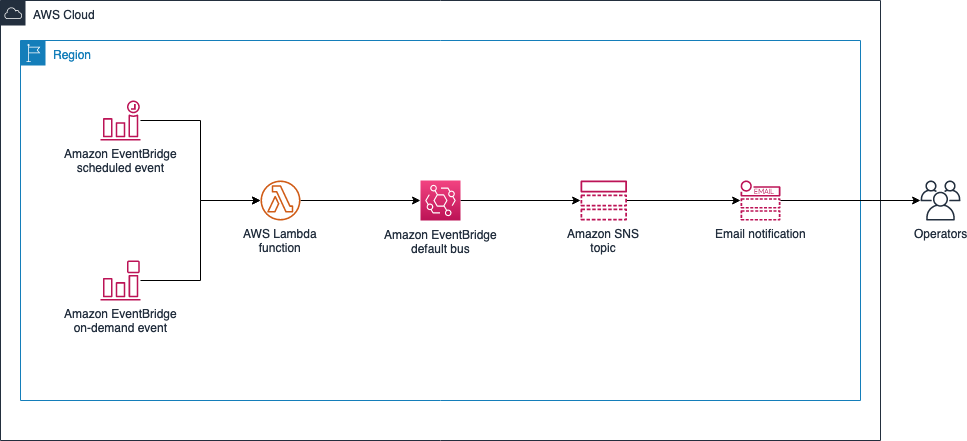

# aws-scheduled-event-adjuster

Several AWS services allow setting up scheduled events, such as Amazon EC2 Auto Scaling actions. However, these schedules are always set in Coordinated Universal Time (UTC). As some countries throughout the world implement Daylight Saving Time, these schedules need to be updated twice per year to account for the changes in the offset between local times and UTC.

This sample solution aims to automatically perform these adjustments, without human intervention, while remaining flexible, configurable, and inexpensive. It currently supports the following resources:

* Amazon EC2 Auto Scaling Groups (ASG) scaling policies
* Amazon EventBridge rules

## Solution architecture

The solution is built on top of serverless components, following an event-driven architecture.



## Deploying the solution

This project is built using the AWS Serverless Application Model (SAM), a framework extending AWS CloudFormation syntax to easily define serverless components such as AWS Lambda functions or Amazon DynamoDB tables.

The following tools are required to deploy it:

* [AWS SAM CLI](https://docs.aws.amazon.com/serverless-application-model/latest/developerguide/serverless-sam-cli-install.html)
* [Python 3](https://www.python.org/downloads/)
* [Docker](https://hub.docker.com/search/?type=edition&offering=community)

To build and deploy for the first time, run the following in your shell:

```bash
sam build --use-container
sam deploy --guided
```

The first command will build the source of your application. The second command will package and deploy your application to AWS, with a series of prompts. If you choose to save your choices to `samconfig.toml`, then you no longer will need to pass the `--guided` flag, as the SAM CLI will read your settings from it.

**Note:** You will be asked for an email address: this is where notifications will be sent whenever the solution performs changes to any of your resources. The email you enter will not be used for any other purpose.

## How to use

All changes are done by the schedule adjuster Lambda function. The solution is opt-in: the adjuster queries all supported resources in its AWS account, but only takes action on those which have been tagged specifically; otherwise they are ignored. For a resource to be processed, it needs to have the following tags:

* `scheduled-event-adjuster:enabled`: this tag tells the adjuster to process this resource. The value of this tag is ignored - only its presence is enough for the adjuster to process the resource.
* `scheduled-event-adjuster:local-timezone`: this tag tells the adjuster in which timezone the schedules are defined. The value must be a valid timezone name, such as `America/New_York` or `Europe/Lisbon`.
* `scheduled-event-adjuster:local-time`: this tag tells the adjuster the time (at the local timezone) at which the event needs to occur.

ASGs work a bit different. As one ASG can have several scheduled scaling actions, the local time tag must be present once for each action that must be processed, following this format: `scheduled-event-adjuster:local-time:<ACTION_NAME>`.

The adjuster is triggered twice per day by an Amazon EventBridge scheduled event, but you can also run it manually by sending an event to the default bus. The solution comes with a script, `send-event.sh`, which does this.

### Examples

#### Amazon EC2 Auto Scaling Groups

We have one ASG with two scaling policies. One, named _MorningScaleOut_, must trigger at 08:00, whereas the other one, _EveningScaleIn_, must happen at 20:00. The specified times are local to the city of Madrid, Spain.

Thus, the ASG must be tagged accordingly:

* `scheduled-event-adjuster:enabled` = (any value)
* `scheduled-event-adjuster:local-timezone` = `Europe/Madrid`
* `scheduled-event-adjuster:local-time:MorningScaleOut` = `08:00`
* `scheduled-event-adjuster:local-time:EveningScaleIn` = `20:00`

#### Amazon EventBridge rules

We have one EventBridge rule which must trigger at 12:00 in the local time of Lisbon, Portugal. The rule must be tagged as follows:

* `scheduled-event-adjuster:enabled` = (any value)
* `scheduled-event-adjuster:local-timezone` = `Europe/Lisbon`
* `scheduled-event-adjuster:local-time` = `12:00`

### Using custom tag prefixes

As explained above, the solution expects all tags to be prefixed with `scheduled-event-adjuster` by default. However, this behavior can be customized by providing a value as the `TagPrefix` SAM parameter. If the solution were deployed like this:

```
sam deploy --parameter-overrides "TagPrefix=foo"
```

Then it would act on resources tagged with `foo:enabled` instead `scheduled-event-adjuster:enabled`.

## Developing

Dependencies for the `AdjustSchedule` function are defined in `adjust_schedule_function/requirements.txt`. To test the function locally, you can build with the following command:

```bash
sam build --use-container
```

The function can be locally invoked using `sam local invoke`. The `events` directory contains test events that can be passed on the function invocation.

```bash
sam local invoke AdjustScheduleFunction --event events/event.json
```

If you want to define environment variables for the function, copy and modify `envs.dist.json` (for example, to `envs.json`) and then use it when invoking the function:

```bash
sam local invoke AdjustScheduleFunction --event events/event.json -n envs.json
```

### Unit tests

Tests are defined in the `tests` folder in this project, and can be run using the [pytest](https://docs.pytest.org/en/latest/):

```bash
scheduled-event-adjuster$ pip install pytest pytest-mock --user
scheduled-event-adjuster$ python -m pytest tests/ -v
```

## Security

See [CONTRIBUTING](CONTRIBUTING.md#security-issue-notifications) for more information.

## License

This project is licensed under the Apache-2.0 License.
